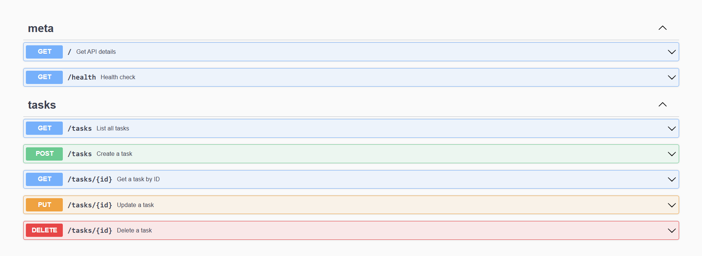

# Task API

A simple REST API built with Go using the standard `net/http` package.

## Features

- List tasks
- Get task by ID
- Create task
- Update task
- Delete task
- Swagger UI
- Health endpoint

---

## Installation

Clone the repository

```bash
git clone https://github.com/Aiyennn/flyrank.git
cd flyrank
```

All the project files (`go.mod`, `go.sum`, and `week_2.go`) are located in the `week_2` directory, so the following commands should be run from there.


Install dependencies

```bash
go mod tidy
```

Run the API

```bash
go run .
```

The server starts on

```
http://localhost:8000
```

Swagger documentation:

```
http://localhost:8000/swagger/index.html
```

---

## API Endpoints

| Method | Endpoint | Description |
|---------|----------|-------------|
| GET | / | API information |
| GET | /health | Health check |
| GET | /tasks | List tasks |
| GET | /tasks/{id} | Get task by ID |
| POST | /tasks | Create task |
| PUT | /tasks/{id} | Update task |
| DELETE | /tasks/{id} | Delete task |

---

## Example curl Output

Command

```bash
curl -i http://localhost:8000/tasks
```

Output

```http
HTTP/1.1 200 OK
Content-Type: application/json
Date: Mon, 14 Jul 2025 14:10:00 GMT
Content-Length: 140

[
  {
    "id":1,
    "title":"Buy groceries",
    "done":false
  },
  {
    "id":2,
    "title":"Walk the dog",
    "done":true
  },
  {
    "id":3,
    "title":"Learn Go",
    "done":false
  }
]
```

---

## Swagger Screenshot
