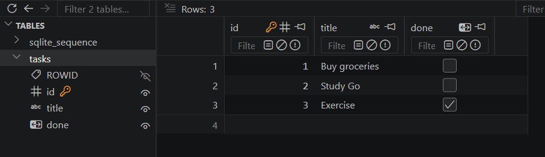

# Week 3: Task API with SQLite

A Go REST API for managing tasks. Unlike the in-memory version, this one stores tasks in SQLite, so data survives server restarts.

## Requirements

- Go 1.26+

## Run the API

```powershell
go run .
```

The server starts at `http://localhost:8080`.

On first run, the app creates `tasks.db` and the `tasks` table automatically, seeding it with three sample tasks.

## Endpoints

| Method | Endpoint | Description |
| --- | --- | --- |
| `GET` | `/tasks` | Get all tasks |
| `POST` | `/tasks` | Create a task |
| `GET` | `/tasks/{id}` | Get a task by ID |
| `PUT` | `/tasks/{id}` | Update a task by ID |
| `DELETE` | `/tasks/{id}` | Delete a task by ID |

---

## Get all tasks

`GET http://localhost:8080/tasks`

**Response:** `200 OK`

```json
[
  { "id": 1, "title": "Buy groceries", "done": false },
  { "id": 2, "title": "Study Go", "done": false },
  { "id": 3, "title": "Exercise", "done": true }
]
```

## Create a task

`POST http://localhost:8080/tasks`

**Body:**

```json
{
  "title": "Finish Assignment 3",
  "done": false
}
```

| Field | Type | Required | Notes |
| --- | --- | --- | --- |
| `title` | string | Yes | Cannot be empty |
| `done` | boolean | No | Defaults to `false` |

**Response:** `201 Created`, with the new task and its generated ID:

```json
{
  "id": 4,
  "title": "Finish Assignment 3",
  "done": false
}
```

## Get a task by ID

`GET http://localhost:8080/tasks/{id}`

**Response:** `200 OK`

```json
{
  "id": 1,
  "title": "Buy groceries",
  "done": false
}
```

## Update a task

`PUT http://localhost:8080/tasks/{id}`

**Body:** same shape as create `title` (required) and `done` (optional, defaults to `false`).

```json
{
  "title": "Buy groceries and cook dinner",
  "done": true
}
```

**Response:** `200 OK`, with the updated task:

```json
{
  "id": 1,
  "title": "Buy groceries and cook dinner",
  "done": true
}
```

## Delete a task

`DELETE http://localhost:8080/tasks/{id}`

**Response:** `204 No Content` (empty body)

---

## Errors

- `400 Bad Request` — invalid JSON, empty title, or invalid ID
- `404 Not Found` — task ID doesn't exist

## Database

Tasks are stored in `tasks.db` (SQLite).

