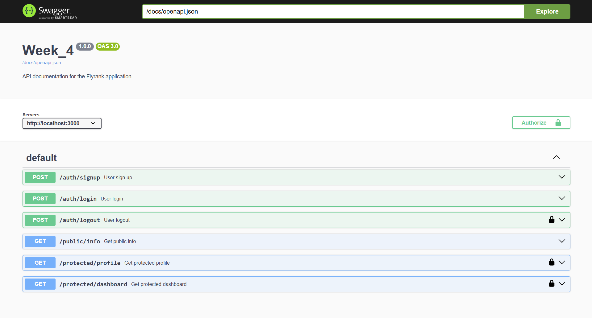

# Week 4: Authentication, Middleware, and API Documentation

This Go-based web application demonstrates a clean, modular API structure using the **Chi Router** and integration with **Supabase Auth (GoTrue)** for secure user management. It implements public and protected routes, token verification, logout mechanics, a reusable middleware guard, and a self-hosted **Swagger UI** for interactive API exploration.

---

## Architecture Overview

The codebase is organized into decoupled, single-responsibility packages inside `internal/`:
- **`auth`**: Handles user registration, login, and session revocation (logout).
- **`middleware`**: Contains the reusable authentication guard that validates Bearer JWT tokens and injects verified user metadata into request contexts.
- **`public`**: Serves public endpoints that require no authentication.
- **`protected`**: Contains secured endpoints (profile, dashboard) that require a valid authorization token.
- **`docs`**: Packages and serves the OpenAPI 3.0 specification and Swagger UI using Go's native file embedding.

---

## API Reference

| Method | Endpoint | Auth Required | Description |
| :--- | :--- | :---: | :--- |
| `POST` | `/auth/signup` | ❌ No | Registers a new user with email and password |
| `POST` | `/auth/login` | ❌ No | Authenticates a user and returns a session JWT access token |
| `POST` | `/auth/logout` |  Yes | Revokes the current session token on Supabase gotrue |
| `GET` | `/public/info` | ❌ No | Returns a public welcome message |
| `GET` | `/protected/profile` |  Yes | Retrieves the verified user's secure metadata (ID, Email, Created At) |
| `GET` | `/protected/dashboard` |  Yes | Retrieves a welcome message for dashboard checkpoint |
| `GET` | `/docs` | ❌ No | Redirects to `/docs/` |
| `GET` | `/docs/` | ❌ No | Hosts the interactive Swagger UI documentation page |
| `GET` | `/docs/openapi.json` | ❌ No | Serves the OpenAPI 3.0 JSON specification schema |

---

## Local Setup

### 1. Prerequisites
Ensure you have **Go 1.26+** installed on your system.

### 2. Environment Configuration
Create a `.env` file in the root directory (or use the preconfigured one) with the following environment variables:

```env
PORT=3000
SUPABASE_URL=https://<your-project-id>.supabase.co
SUPABASE_KEY=<your-anon-or-service-key>
DATABASE_URL=postgresql://<username>:<password>@<host>:<port>/<dbname>
```

---

## How to Run

1. Clone or navigate to the project directory.
2. Compile and run the server using:
   ```bash
   go run cmd/main.go
   ```
3. The server will start on the port configured in `.env` (defaults to `:3000`):
   ```
   2026/08/15 15:52:48 Supabase client initialized
   2026/08/15 15:52:48 starting server on :3000
   ```

---

## Interactive API Documentation (Swagger UI)

To explore and test the endpoints interactively, visit the local Swagger page:
👉 [**http://localhost:3000/docs/**](http://localhost:3000/docs/)

### Secure Testing Flow:
1. Under **`POST /auth/login`**, click **Try it out**, submit your credentials, and copy the returned `access_token`.
2. Click the green **Authorize** padlock button at the top of the documentation page.
3. Paste the token into the Value box and click **Authorize**.
4. You can now execute any of the locked routes (e.g. `GET /protected/profile`) directly inside Swagger.

### Screenshot
Below is a screenshot of the Swagger UI documentation showing the locked and unlocked endpoints:


